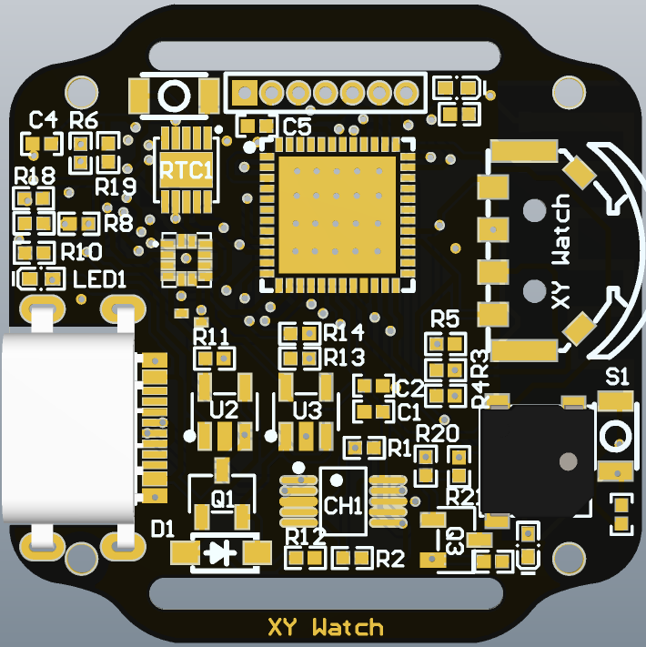
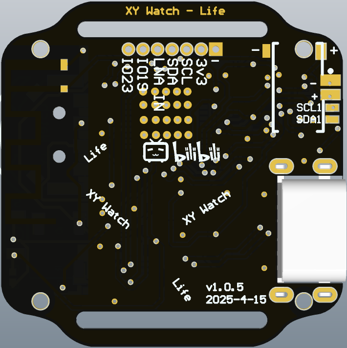
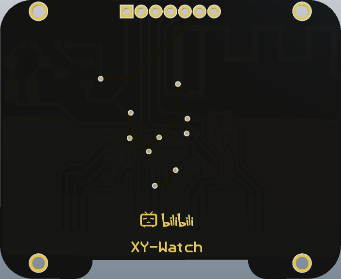
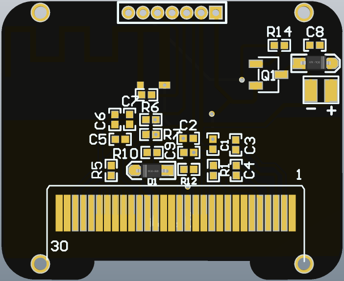

# XYWatchy hardware

## PCB preview

### drive

  

### display

## 主要元件

|      | 型号      | 购买链接      |
|------------|------------|------------|
| SoC     | ESP32-PICO-D4     |  [淘宝](https://item.taobao.com/item.htm?_u=nfl2f5ge491&id=802407293089&skuId=5465551773441&spm=a1z09.2.0.0.54c72e8dzYZERC)     |
| RTC | PCF8563BS | [淘宝](https://item.taobao.com/item.htm?id=756706038432&spm=tbpc.boughtlist.suborder_itemtitle.1.42092e8d5rsiuO) |
| USB-Serial     | CH340x     |   [淘宝](https://item.taobao.com/item.htm?_u=nfl2f5gfe4e&id=805524051748&spm=a1z09.2.0.0.54c72e8dzYZERC)   |
| TYPE-C   | TYPE-C 母座 16P/沉板1.6     |    [淘宝](https://item.taobao.com/item.htm?id=847085611169&spm=tbpc.boughtlist.suborder_itemtitle.1.42092e8d5rsiuO)   |
| 运动传感器    | BMA423/BMA425     |  [淘宝](https://item.taobao.com/item.htm?_u=nfl2f5gc82f&id=585190973333&sku_properties=-1%3A-1&spm=a1z09.2.0.0.54c72e8dzYZERC)     |
| 无源蜂鸣器 | MLT-5020 3v | [淘宝](https://item.taobao.com/item.htm?id=904963885727&spm=tbpc.boughtlist.suborder_itemtitle.1.42092e8d5rsiuO) |
| 0.96寸OLED显示屏 | 蓝光 | [淘宝](https://item.taobao.com/item.htm?id=771751339592&skuId=5457594059803&spm=tbpc.boughtlist.suborder_itemtitle.1.42092e8d5rsiuO) |
| 1.27mm间距排母 | 1x7P（塑高2.0mm）| [淘宝](https://item.taobao.com/item.htm?_u=nfl2f5gee9e&id=533845762209&skuId=3898422332914&spm=a1z09.2.0.0.54c72e8dzYZERC) |
| 三向开关 | LY-K6-01 | [淘宝](https://item.taobao.com/item.htm?_u=nfl2f5g573c&id=607224934874&spm=a1z09.2.0.0.54c72e8dzYZERC) |
| 轻触开关 | 2x3x1.5mm | [淘宝](https://item.taobao.com/item.htm?_u=nfl2f5g09ac&id=852427078276&spm=a1z09.2.0.0.54c72e8dzYZERC) |
|PCB连接器螺丝| M1.4x3 | [淘宝](https://detail.tmall.com/item.htm?_u=nfl2f5gd49f&id=671590959819&skuId=5199969587667&spm=a1z09.2.0.0.54c72e8dzYZERC) |
|PCB连接器铜柱| M1.4x2.5x3 | [淘宝](https://item.taobao.com/item.htm?_u=nfl2f5g9475&id=809151694062&spm=a1z09.2.0.0.54c72e8dzYZERC) |
|3.7V电池| 502025-200毫安 (如需要更薄, 可以买302025电池) | [淘宝](https://item.taobao.com/item.htm?id=784361648217&spm=tbpc.boughtlist.suborder_itemtitle.1.42092e8d5rsiuO)|
|表带|表带宽15mm|[淘宝](https://item.taobao.com/item.htm?id=872619805915&spm=tbpc.boughtlist.suborder_itemtitle.1.42092e8d5rsiuO)|